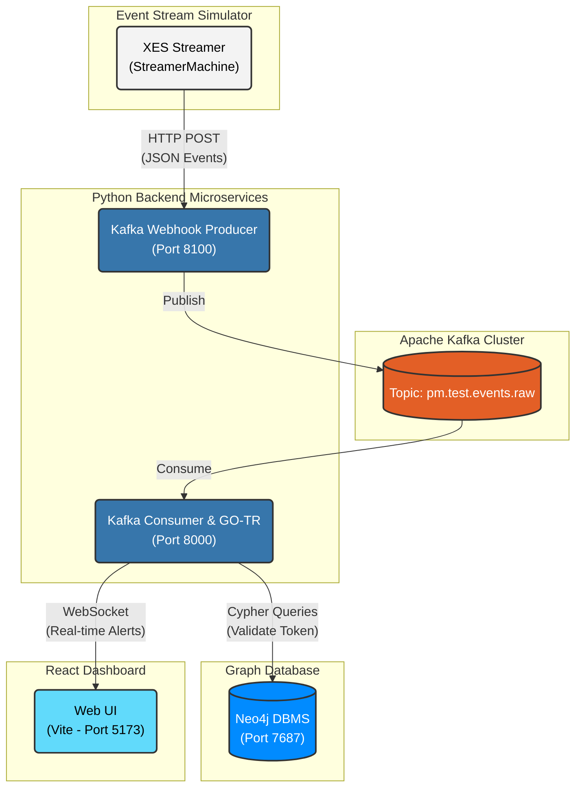

# GO-TR Real-time Deviation Monitor

A Real-time Process Mining application implementing the **GO-TR (Graph-Oriented Token Replay)** algorithm. This system performs continuous conformance checking on event streams, detecting deviations (such as `missing_token` or organizational violations) as they happen in real-time.

---

## Architecture Stack



This project is built using a modern microservices architecture:
*   **Graph Database:** Neo4j (Used to map and query process/organizational models)
*   **Message Broker:** Apache Kafka (Handles high-throughput event streaming)
*   **Backend:** Python & FastAPI (Runs the GO-TR algorithm, handles Kafka streams)
*   **Frontend:** React + Vite (A real-time dashboard displaying alerts via WebSockets)
*   **Process Analytics:** pm4py (Process Mining for Python)

## Repository Structure

*   `OnlineApps/` - The core real-time microservices architecture.
    *   `kafka-docker/` - Docker Compose configuration for the Kafka cluster.
    *   `Frontend/kafka-dashboard/` - React application for real-time monitoring.
    *   `Backend/` - Python microservices:
        *   `KafkaConsumer/` - Subscribes to Kafka, runs GO-TR, and pushes anomalies to WebSocket.
        *   `KafkaProducer/` - A webhook server that receives external events and publishes them to Kafka.
        *   `StreamerMachine/` - Simulates a live event stream by parsing `.xes` logs and feeding the Producer.
        *   `Algorithm/` - The core mathematical and Neo4j implementation of GO-TR.
*   `process_mining/` - Legacy/Offline version using Django.
*   `*.xes` - Various Event Log datasets used for testing and simulation.

---

## Getting Started

Follow these steps to run the complete real-time pipeline locally.

### Prerequisites
*   [Docker Desktop](https://www.docker.com/products/docker-desktop/)
*   [Node.js (NPM)](https://nodejs.org/)
*   [Python 3.12](https://www.python.org/) *(Avoid Python 3.13/3.14 to prevent `scipy` compilation errors)*
*   [Neo4j Desktop](https://neo4j.com/download/)

### 1. Database Setup (Neo4j)
1. Open Neo4j Desktop and create a new local DBMS.
2. Ensure it is running on `bolt://127.0.0.1:7687` or `neo4j://127.0.0.1:7687`.
3. Set the authentication credentials to Username: `neo4j` and Password: `12345678`.

### 2. Install Dependencies
A `Makefile` is provided in the root directory to automate the setup process. Run the following command from the root to install both backend (Python `.venv`) and frontend (npm) dependencies:
```bash
make setup
```
> **Note:** The setup script automatically uses Python 3.12 to comply with macOS PEP 668 and successfully download `pm4py`/`scipy` binaries.

### 3. Start the Application
You can use the `Makefile` to easily run the different components. Open separate terminals in the project root and run:

**Terminal 1: Start Infrastructure (Kafka)**
```bash
make infra-up
```

**Terminal 2: Start the Consumer & WebSocket Server**
```bash
make consumer
```
*(Runs on port 8000. Connects to Neo4j and serves the UI).*

**Terminal 3: Start the Producer Webhook**
```bash
make producer
```
*(Runs on port 8100. Listens for incoming events to push to Kafka).*

**Terminal 4: Start the Frontend UI**
```bash
make frontend
```
The dashboard will be available at: [http://localhost:5173](http://localhost:5173)

### 4. Run the Event Simulator
Once all services are running, you can stream `output_logv2test2.xes` to simulate a live system:
```bash
make streamer
```

---

## How It Works
1. When you start the Consumer (`Main.py`), it initializes the **Master Model** from `datacsv_repair.csv` and pushes the graph structure to Neo4j.
2. The Streamer begins reading the XES file and sending HTTP POST requests to the Producer.
3. The Producer publishes these events to the `pm.test.events.raw` Kafka topic.
4. The Consumer reads from Kafka, validates the trace path in Neo4j using Token Replay (GO-TR), and detects missing tokens or wrong assignments.
5. Detected anomalies are instantly broadcasted via WebSockets to the React Dashboard.

---

## Academic Lineage & Citation

This architecture and its core algorithms are a direct implementation of the research published in IEEE Access (2022) by Indra Waspada, Riyanarto Sarno, Endang Siti Astuti, Hanung Nindito Prasetyo, and Raden Budiraharjo. The GO-TR algorithm was specifically designed to solve the **memory limitation problem** found in conventional online conformance checking techniques (like Prefix-Alignment) by persisting the *Replay Image* into a Graph Database.

> **Reference:**
> I. Waspada, R. Sarno, E. S. Astuti, H. N. Prasetyo and R. Budiraharjo, "Graph-Based Token Replay for Online Conformance Checking," in *IEEE Access*, vol. 10, pp. 102737-102752, 2022, doi: 10.1109/ACCESS.2022.3208098.
